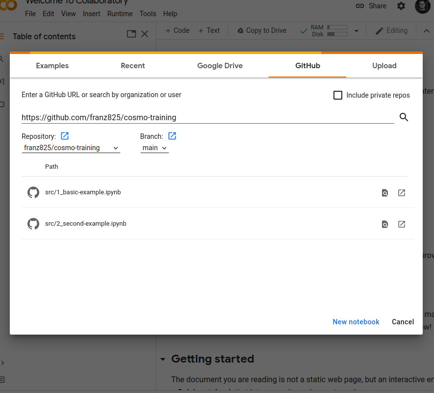
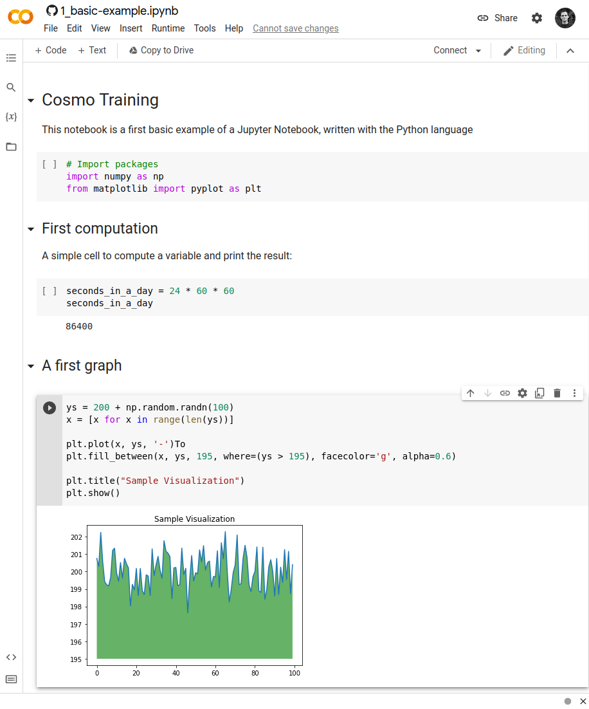

# Cosmo Training

## Purpose

This repository contains the didactic material for the exercise about cosmogenic radionuclide dating, in the frame of the training course in geochronology 2022.

## Schedule

First, read the section "Interactive environment" here below. Then, browse the different notebooks available the `src` directory. Notebooks are numbered: `1_XXX`, `2_XXX`. So, follow the proper sequence.

## Interactive environment

In order to achieve the exercises, you will use the "Google Colaboratory" (or Google Colab) interface, available [here](https://colab.research.google.com). This web interface enables you to interpret Jupyter Notebooks (text files containing a mix of text and code cells), written in the Python langage. Jupyter notebooks (`.ipynb` file extension) for the training session are located in the `src` directory of this repository. Each notebook can be directly opened in Google Colab, as follows:

1. Open the Google Colab interface in your browser: [https://colab.research.google.com/](https://colab.research.google.com/).
2. In the Menu box, click on the `Github` tab.
3. Copy the URL of this repository: [https://github.com/franz825/cosmo-training](https://github.com/franz825/cosmo-training).
4. And paste it in the `Enter a Github URL` field. Hit `Enter`.
5. Notebooks available in the repository appear below in the box. Simply click on the appropriate `.ipynb` file to open it.

The notebook is composed of two types of cells:

- Text cells, which simply contain text, formattted in [Markdown](https://www.markdownguide.org/).
- Code cells, which contain Python code, that you can execute and use to compute results.

To run a code cell, click on the `Play` button or hit `Ctrl + Enter`.

