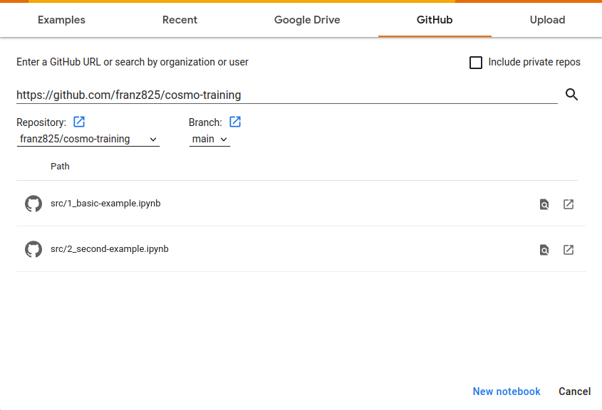

# Technical considerations

## Jupyter notebooks

Jupyter notebooks for the training session are located in the `src` directory of this repository.

Jupyter notebooks (`.ipynb` file extension) are text files containing a mix of text (e.g. explanations, equations,...) and code cells:

- Text cells, which simply contain text, formattted in [Markdown](https://www.markdownguide.org/).
- Code cells, which contain Python code, that you can execute interactively.

## Interactive environment

The easiest way to read and interpret Jupyter notebooks in the frame of this Cosmo Training sesssion is to use the "Google Colaboratory" (or Google Colab) interface, available [here](https://colab.research.google.com). This web interface enables you to interpret Jupyter Notebooks in an online and interactive environment. Each notebook can be directly opened in Google Colab, as follows:

1. Open the Google Colab interface in your browser: [https://colab.research.google.com/](https://colab.research.google.com/).

2. In the Menu box, click on the `Github` tab.

3. Copy the URL of this repository: [https://github.com/franz825/cosmo-training](https://github.com/franz825/cosmo-training).

4. And paste it in the `Enter a Github URL` field. Hit `Enter`.

5. Notebooks available in the repository appear below in the box. Simply click on the appropriate `.ipynb` file to open it.

To run a code cell, click on the `Play` button in the upper left corner of the cell, or hit `Ctrl + Enter`.

## Local environment

If you do not have a Google account to connect to Google Colab (and do not want to create one), you can run a [Anaconda](https://www.anaconda.com/) environment locally on your machine, to interpret Jupyter Notebooks.

The Anaconda environment is available for Windows, MacOS and Linux. The installation should be pretty straightforward as it is available as graphical installers. However, the installation files are pretty big (ca. 500 Mo !). So please plan ahead this technical step, for which we do not provide assistance as it is not the goal of the training course.

Once the installation process is done:

1. Open Anaconda and lauch the Jupyter Notebook application.

2. In a dedicated directory on your machine, download the current Github repository from this [link](https://github.com/franz825/cosmo-training/zipball/master/) or by saving the `.zip` file as depicted below:

3. Unzip the archive.

4. In your Jupyter environment, browse in your directory structure to find the local repository (the one you just downloaded) and open notebooks stored in the `src` directory.
